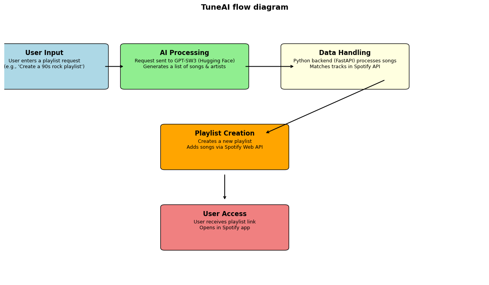
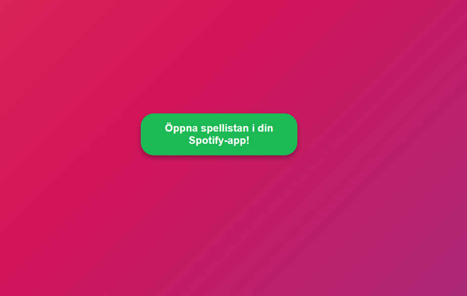

# TuneAI
A glimpse of the TuneAI Spotify playlist generator

## Overview
TuneAI is an AI-powered Spotify playlist generator that dynamically creates playlists based on user input. 
It leverages GPT-SW3 (AI Sweden) hosted on Hugging Face to process natural language prompts and integrates directly with Spotify Web API for real-time playlist creation.

## System Architecture & Flow
1. **User Input**: The user enters a text prompt describing their desired playlist.
2. **AI Processing**: The request is sent to GPT-SW3 on Hugging Face, which generates a list of songs and artists.
3. **Data Handling & API Integration**: The song list is processed and matched against Spotify’s catalog.
4. **Playlist Creation**: A new playlist is created and populated with the matched tracks.
5. **User Access**: The user receives a direct link to the playlist, which opens in the Spotify app.



## Key Features
- **AI-Driven Playlist Creation**: Utilizes GPT-SW3 for natural language processing.
- **Spotify Integration**: Real-time playlist creation using Spotify Web API.
- **Performance Optimizations**: Batch processing, Redis caching, asynchronous API calls, and keep-alive scripts.

## Screenshots




## Code Snippets (Illustrative)
### Example: Sending the User’s Prompt to Hugging Face API
```python
# Pseudocode to illustrate the process
def generate_song_list(prompt):
    # Send request to Hugging Face API
    response = api_call_to_hugging_face(prompt)
    # Process response to extract song list
    return extract_song_list(response)
